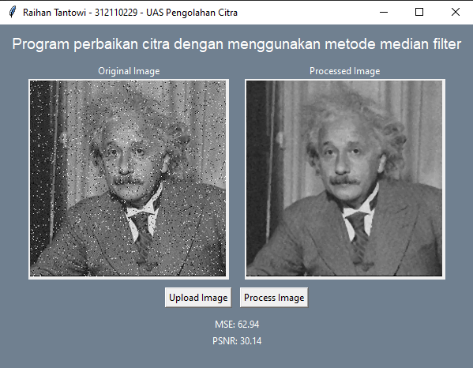
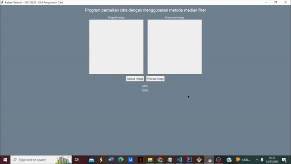

# UAS - Pengolahan Citra
```
Dosen Pengampu   : Muhammad Najamuddin Dwi Miharja, S.Kom, M.Kom
Mata Kuliah      : Pengolahan Citra
Nama             : Raihan Tantowi
Nim              : 312110229
Kelas            : TI.21.C.1
```
#### Kode program pada repo di github ini adalah sebuah aplikasi GUI sederhana yang menggunakan library Tkinter untuk mengimplementasikan metode median filter pada citra. Aplikasi ini memungkinkan pengguna untuk mengunggah citra, memproses citra tersebut dengan metode median filter, dan menampilkan citra asli dan citra yang telah diproses serta juga menampilkan nilai mse dan pnsr dari hasil citra tersebut.
     
* **Berikut adalah penjelasan singkat mengenai komponen utama dalam kode program tersebut :**  
```
1.) Import library:
    - `tkinter`: Digunakan untuk membuat antarmuka grafis.
    - `filedialog` dari `tkinter`: Digunakan untuk mengatur dialog pengunggahan berkas.
    - `Image` dan `ImageTk` dari library PIL (Python Imaging Library): Digunakan untuk memanipulasi dan menampilkan gambar.
    - `numpy` (diimpor sebagai `np`): Digunakan untuk melakukan operasi numerik pada array.
    - `math`: Digunakan untuk operasi matematika.

2.) Fungsi `calculate_mse(original, processed)`: Menghitung nilai Mean Squared Error (MSE) antara citra asli dan citra yang telah diproses dengan metode median filter.

3.) Fungsi `calculate_psnr(mse, max_pixel=255.0)`: Menghitung nilai Peak Signal-to-Noise Ratio (PSNR) berdasarkan nilai MSE dan nilai piksel maksimum.

4.) Fungsi `median_filter(image_array, filter_size)`: Menerapkan metode median filter pada array citra dengan ukuran filter tertentu. Fungsi ini mengembalikan citra yang telah diproses.

5.) Kelas `Application` yang mewarisi `tk.Tk`: Merupakan kelas utama yang mengatur antarmuka aplikasi dan interaksi pengguna. Pada konstruktor, elemen-elemen antarmuka seperti judul, frame gambar, label, tombol, dan sebagainya diinisialisasi dan ditampilkan. Ada juga metode `upload_image()` untuk mengunggah gambar, `process_image()` untuk memproses gambar dengan metode median filter, dan `display_image()` untuk menampilkan gambar pada canvas.

6.) Pada bagian terakhir, kode program memeriksa apakah file ini dijalankan langsung (`__name__ == "__main__"`) dan kemudian membuat objek `Application` dan memulai aplikasi dengan metode `mainloop()`.
```

* **Berikut adalah hasil dari program yang telah dibuat :**




* **Demo program :**

<div>
  
</div>


#
#### *Note :*
Untuk menjalankan kode program tersebut, Yaitu perlu menginstal beberapa library. Berikut adalah daftar library yang perlu diinstal :
```
1. Tkinter: Library ini biasanya sudah terpasang secara default jika Anda menggunakan distribusi Python standar seperti CPython. Jika Anda menggunakan distribusi Python lain atau jika Tkinter belum terpasang, Anda perlu menginstalnya terlebih dahulu.

2. PIL (Python Imaging Library): Library ini digunakan untuk memanipulasi dan menampilkan gambar. Anda dapat menginstalnya dengan perintah berikut :
"pip install Pillow"

3. NumPy: Library ini digunakan untuk operasi numerik pada array. Anda dapat menginstalnya dengan perintah berikut :
"pip install numpy"
```
Setelah menginstal library yang diperlukan, Anda dapat menjalankan kode program tersebut tanpa masalah. 